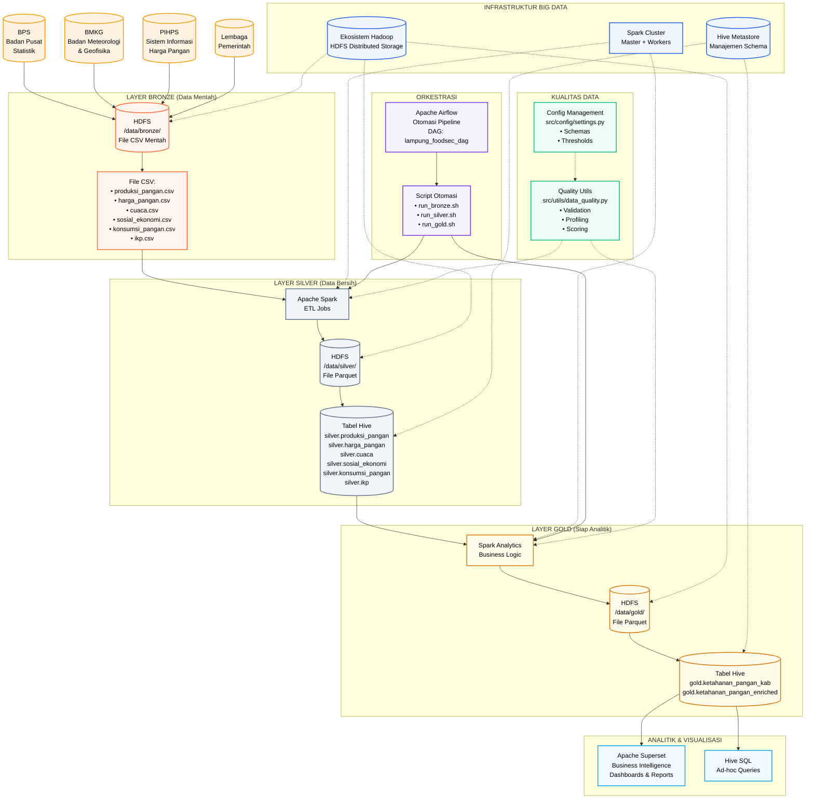

# Arsitektur Pipeline Big Data Ketahanan Pangan Lampung

Diagram ini mengilustrasikan arsitektur pipeline big data yang komprehensif, menunjukkan alur data dari sumber eksternal melalui layer medallion (Bronze-Silver-Gold), komponen infrastruktur, orkestrasi, dan visualisasi analitik.

## Komponen Arsitektur

### Sumber Data
- **BPS**: Badan Pusat Statistik (data produksi, konsumsi)
- **BMKG**: Badan Meteorologi dan Geofisika (data cuaca, iklim)
- **PIHPS**: Sistem Informasi Harga Pangan
- **Lembaga Pemerintah**: Data sosial ekonomi tambahan

### Layer Arsitektur Medallion
- **Bronze**: File CSV mentah disimpan di HDFS
- **Silver**: File Parquet yang dibersihkan dan divalidasi dengan tabel Hive
- **Gold**: Metrik business dan indikator siap analitik

### Infrastruktur
- **Hadoop HDFS**: Distributed file storage
- **Apache Spark**: Distributed processing engine
- **Hive**: Data warehouse dan interface SQL
- **Airflow**: Orkestrasi workflow
- **Superset**: Business intelligence dan visualisasi

### Kualitas Data & Engineering
- Manajemen konfigurasi terpusat
- Validasi dan profiling data otomatis
- Quality scoring dan reporting
- Penegakan schema dan consistency checks